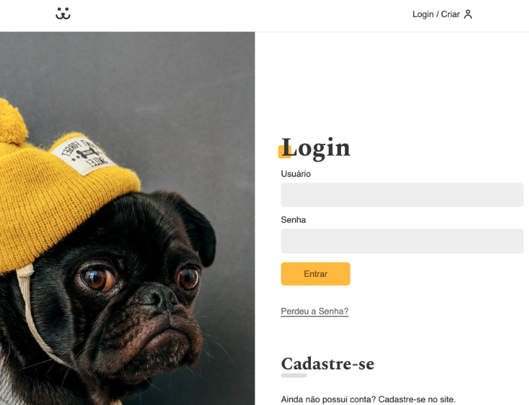

# DOGS - Aplicação React

DOGS é uma aplicação desenvolvida em React que permite aos usuários fazer login, postar fotos e visualizar fotos, enquanto consome uma API.

Projeto realizado junto ao curso de React da Origamid®, durante meus estudos de React js.

## Interface

<div align="center">
  
</div>

## Sumário

- [Tecnologias Utilizadas](#tecnologias-utilizadas)
- [Status](#status)
- [Descrição](#descrição)
- [Funcionalidades](#funcionalidades)
- [Como Usar](#como-usar)
- [Estrutura do Projeto](#estrutura-do-projeto)
- [Autor](#autor)

## Tecnologias Utilizadas

<div style="display: flex; flex-direction: row;">
  <div style="margin-right: 20px; display: flex; justify-content: flex-start;">
    
  </div>
</div>

## Status


## Descrição

Este projeto é uma aplicação que consiste em uma plataforma onde os usuários podem se registrar, fazer login, postar fotos de seus cães e visualizar as fotos postadas por outros usuários.

## Funcionalidades

- Autenticação de usuário.
- Postagem de fotos.
- Visualização de fotos postadas.
- Rotas protegidas para usuários logados.

## Como Usar

1. Clone o repositório em sua máquina local:
   ```sh
   git clone https://github.com/dgusfr/dogs.git
   ```
2. Navegue até a pasta do projeto:
   ```sh
   cd dogs
   ```
3. Instale as dependências necessárias:
   ```sh
   npm install
   ```
4. Execute o projeto:
   ```sh
   npm start
   ```

A aplicação estará rodando no endereço `http://localhost:3000`.

## Estrutura do Projeto

```bash
src/
├── Components/
│   ├── Header.js
│   ├── Footer.js
│   ├── Home.js
│   ├── Login/
│   │   ├── Login.js
│   │   └── LoginForm.js
│   ├── User/
│   │   ├── User.js
│   │   └── UserProfile.js
│   ├── Helper/
│   │   └── ProtectedRoute.js
├── UserContext.js
├── App.css
├── App.js
├── index.js


```
